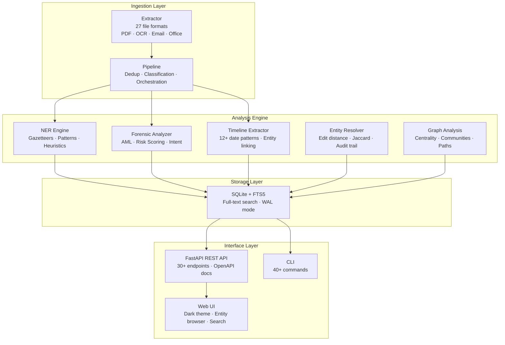

# DOSSIER — Document Intelligence & Investigative Analytics Platform

A local-first platform for ingesting, analyzing, and mapping connections across large document collections. DOSSIER combines multi-format extraction, forensic analysis, entity resolution, timeline reconstruction, and network analysis into a single investigative toolkit — no cloud dependencies required.

Built for OSINT research, FOIA analysis, financial forensics, and any domain where understanding relationships across thousands of documents is the job.

## Architecture



## Capabilities

### Document Ingestion
- **27 file formats** — PDF (native + OCR), images (PNG/JPG/TIFF), DOCX, XLSX, CSV, JSON, XML, HTML, RTF, EML, MSG, MBox, ZIP archives
- **SHA-256 deduplication** — prevents re-ingestion of identical files
- **Auto-classification** — categorizes documents as depositions, flight logs, correspondence, reports, legal filings, emails, lobbying disclosures
- **Batch processing** — recursive directory scanning with error resilience

### Named Entity Recognition
- **4-layer extraction** — gazetteers, regex patterns, heuristics, keyword analysis
- **Domain-aware** — custom gazetteer sets for people, places, and organizations
- **False positive filtering** — heuristic cleanup reduces noise from boilerplate text
- **Keyword extraction** — term frequency analysis with stop word filtering

### Forensic Analysis
- **Financial forensics** — money laundering indicators (structuring, layering, shell companies)
- **AML/CTR detection** — flags transactions against high-risk jurisdictions
- **Intent classification** — classifies language as transactional, coordinating, evasive, or threatening
- **Codeword detection** — identifies anomalous language patterns
- **Risk scoring** — composite 0.0–1.0 score per document with severity levels

### Timeline Reconstruction
- **12+ date pattern extractors** — full dates, partial dates, seasons, approximations, relative references
- **ISO normalization** — consistent date representation via `dateutil`
- **Entity-event linking** — connects entities to events via same-sentence co-occurrence
- **Unresolved date tracking** — relative dates flagged for manual review

### Entity Resolution
- **Non-destructive merging** — mapping table preserves original data
- **Multiple strategies** — exact match, normalized match, edit distance (Levenshtein), Jaccard similarity
- **Audit trail** — full history of merge/split operations
- **Suggest vs. auto-merge** — confidence-based action selection

### Network Analysis
- **Co-occurrence graph** — entity relationships built from document overlap
- **Centrality metrics** — degree, betweenness, closeness, eigenvector
- **Community detection** — Louvain method for cluster identification
- **Path analysis** — shortest paths and neighborhood queries

### Full-Text Search
- **SQLite FTS5** — Porter stemming, Unicode support, ranked results
- **Snippet generation** — highlighted context around matches
- **Category filtering** — scope searches to specific document types

## Quick Start

```bash
# Install
pip install -e ".[dev]"

# Ingest a file
python -m dossier ingest path/to/document.pdf --source "FOIA Release"

# Ingest a directory
python -m dossier ingest-dir path/to/documents/ --source "Court Records"

# Ingest emails
python -m dossier ingest-emails path/to/mailbox/

# Start the web server
python -m dossier serve

# Search
python -m dossier search "palm beach"

# View corpus stats
python -m dossier stats

# List top entities
python -m dossier entities person

# View forensic flags
python -m dossier forensics --min-risk 0.5

# Reconstruct timeline
python -m dossier timeline --start 2000-01-01 --end 2010-12-31

# Run entity resolution
python -m dossier resolve

# Analyze network
python -m dossier graph centrality --metric betweenness
python -m dossier graph communities
```

## API Reference

Start the server with `python -m dossier serve`, then visit `http://localhost:8000/docs` for interactive OpenAPI documentation.

### Search & Documents
| Method | Endpoint | Description |
|--------|----------|-------------|
| GET | `/api/search?q=...` | Full-text search with snippets and category filters |
| GET | `/api/documents` | List documents with entity counts |
| GET | `/api/documents/{id}` | Document detail with entities and keywords |
| POST | `/api/documents/{id}/flag` | Toggle document flag |
| POST | `/api/upload` | Upload and ingest a file |
| POST | `/api/ingest-directory` | Batch ingest a directory |

### Entities & Keywords
| Method | Endpoint | Description |
|--------|----------|-------------|
| GET | `/api/entities?type=...` | Top entities by type and count |
| GET | `/api/entities/search?q=...` | Entity substring search |
| GET | `/api/entities/{id}/documents` | Documents containing an entity |
| GET | `/api/keywords` | Top keywords corpus-wide |
| GET | `/api/connections?entity_id=...` | Entity co-occurrence network |

### Forensics & Similarity
| Method | Endpoint | Description |
|--------|----------|-------------|
| GET | `/api/forensics` | Forensic results by risk score, severity, flag |
| GET | `/api/similar-documents/{id}` | Find similar documents |
| GET | `/api/duplicates` | Potential duplicate document pairs |
| GET | `/api/stats` | Dashboard statistics |

### Timeline
| Method | Endpoint | Description |
|--------|----------|-------------|
| GET | `/api/timeline` | Query events by date range, entity, confidence |
| GET | `/api/timeline/stats` | Timeline summary statistics |
| GET | `/api/timeline/unresolved` | Relative dates needing manual review |

### Entity Resolution
| Method | Endpoint | Description |
|--------|----------|-------------|
| POST | `/api/resolver/resolve` | Run entity resolution across corpus |
| POST | `/api/resolver/resolve/{id}` | Resolve single entity |
| GET | `/api/resolver/duplicates` | Find duplicate entities |

### Graph Analysis
| Method | Endpoint | Description |
|--------|----------|-------------|
| GET | `/api/graph/stats` | Network statistics |
| GET | `/api/graph/centrality?metric=...` | Top entities by centrality metric |
| GET | `/api/graph/communities` | Detected communities (Louvain) |
| GET | `/api/graph/path/{source}/{target}` | Shortest path between entities |
| GET | `/api/graph/neighbors/{id}` | Entity neighborhood (configurable hops) |

## Project Structure

```
dossier/
├── __main__.py                  # CLI (40+ commands)
├── api/
│   └── server.py                # FastAPI server (30+ endpoints)
├── core/
│   ├── ner.py                   # NER engine + classifier + keywords
│   ├── forensic_analyzer.py     # AML detection + risk scoring
│   ├── resolver.py              # Entity resolution + audit trail
│   ├── graph_analysis.py        # Network analysis (NetworkX)
│   ├── api_resolver.py          # Resolver API routes
│   └── api_graph.py             # Graph API routes
├── forensics/
│   ├── timeline.py              # Timeline reconstruction engine
│   └── api_timeline.py          # Timeline API routes
├── db/
│   └── database.py              # SQLite + FTS5 schema
├── ingestion/
│   ├── extractor.py             # Multi-format text extraction
│   ├── pipeline.py              # Ingestion orchestrator
│   ├── email_parser.py          # EML/MBox parser
│   ├── email_pipeline.py        # Batch email ingestion
│   └── scrapers/                # Data source connectors
├── static/
│   └── index.html               # Dark-themed web UI
└── data/
    └── dossier.db               # SQLite database
```

## Testing

385 tests across 15 test modules. CI enforces 95%+ coverage, Ruff linting, CodeQL security scanning, Gitleaks secret detection, and performance benchmarks with regression gates.

```bash
# Run all tests
pytest tests/ -v

# With coverage
pytest tests/ --cov=dossier --cov-report=term-missing

# Benchmarks only
pytest tests/test_benchmarks.py -v
```

## Tech Stack

| Component | Technology |
|-----------|-----------|
| Language | Python 3.10+ |
| API | FastAPI + Uvicorn |
| Database | SQLite + FTS5 (WAL mode) |
| PDF | pdfplumber + Tesseract OCR |
| Office | python-docx, openpyxl |
| Network | NetworkX (centrality, communities, paths) |
| Dates | python-dateutil |
| CI/CD | GitHub Actions (pytest, CodeQL, gitleaks, pip-audit) |

## License

MIT
